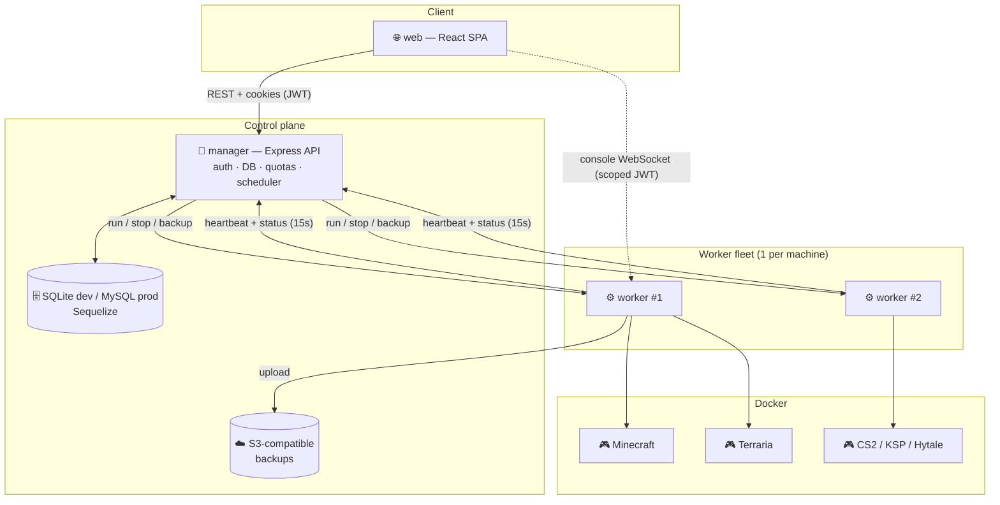
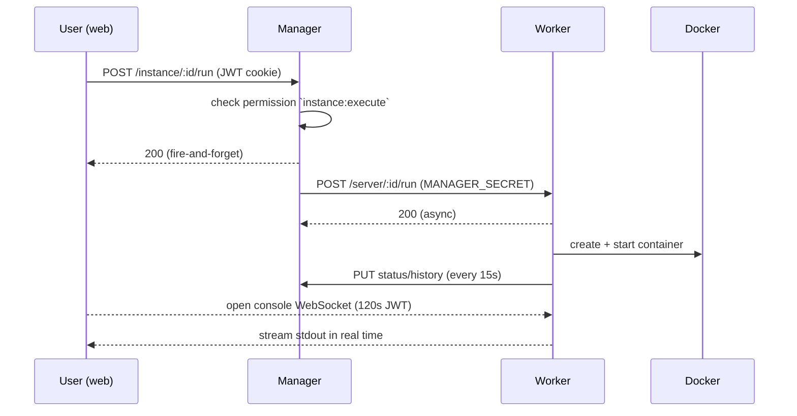
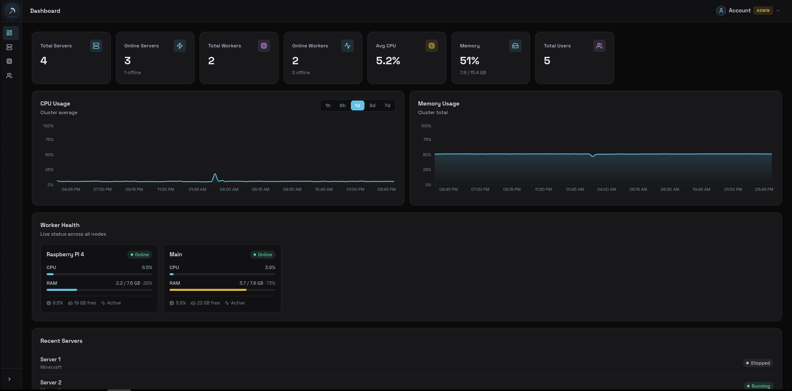
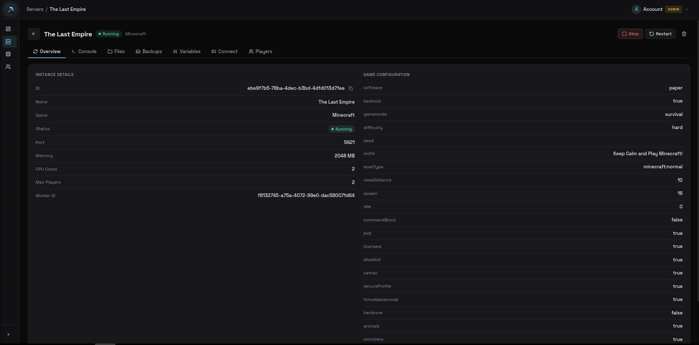
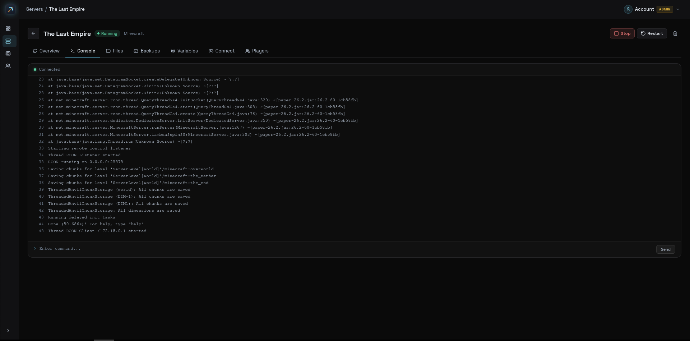
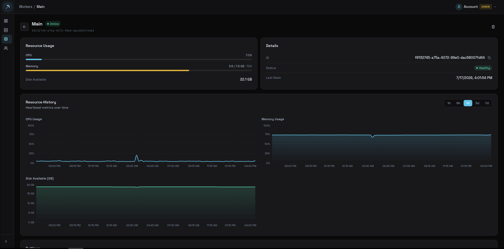

<div align="center">

# 🎮 NodeCraft

**A self-hosted, multi-node game server hosting platform — think Aternos / Apex Hosting, built from scratch.**

Create, configure, run and monitor game servers for **Minecraft, Counter-Strike 2, Terraria, Kerbal Space Program and Hytale** from a single web panel — with real-time consoles, automated cloud backups, granular per-instance permissions and a distributed worker fleet running everything in isolated Docker containers.

-2ea44f)


</div>

---

## 📖 Overview

**NodeCraft** is a full-stack, distributed platform for hosting and managing multiplayer game servers. It's my flagship personal project: a working MVP that already handles the complete lifecycle end-to-end — a user signs up, spins up a game server, edits its files and settings, watches the live console, and gets it backed up automatically every night.

The system is split into three independent services that talk over authenticated HTTP + WebSockets:

| Service | Role | Port |
|---------|------|------|
| **`manager`** | Central control plane — authentication, database, quotas, scheduling; orchestrates the workers. | `9183` |
| **`worker`** | Runs the actual game instances as Docker containers (one worker per physical machine). | `9184` |
| **`web`** | React single-page app — the user-facing control panel. | `3030` (dev) |

It runs in a real self-hosted production environment (behind Nginx + systemd, deployed via GitHub Actions). *The public instance isn't linked here because new accounts are provisioned with a zero-instance quota by default — the panel is fully functional but instance creation is admin-gated.*

---

## ✨ Key Features

- 🐳 **Docker-based isolation** — every game server runs in its own container, created and controlled programmatically via `dockerode`.
- 🖧 **Distributed worker fleet** — the manager coordinates any number of worker machines; each reports CPU / memory / disk health every 15s and is marked unhealthy if it goes silent.
- 🎮 **Multi-game support** — Minecraft (Java + Bedrock via Geyser/Floodgate), Counter-Strike 2, Terraria, Kerbal Space Program and Hytale, each with its own runtime and settings.
- 💻 **Real-time console** — live server output and command input streamed over Socket.io, secured with short-lived (120s) scoped JWTs so the browser talks straight to the worker.
- 📁 **Full file manager** — browse, edit, upload, download, move, delete and unzip files inside a server's game folder, proxied through the manager to the right worker.
- 🔐 **JWT auth + email flows** — access/refresh token rotation via httpOnly cookies, email verification and password reset (Nodemailer).
- 🧑‍⚖️ **Granular per-instance permissions** — share a server with other users at the level of individual actions (`console:read`, `files:write`, `backup`, …), with an access model (`super` / `always` / `monitored`) and in-game privileges.
- 📊 **Resource quotas** — per-user limits on instance count, total memory, CPU, disk and which games / workers they may use.
- 💾 **Automated S3 backups** — nightly scheduled backups to any S3-compatible bucket (Backblaze / MinIO / AWS), with daily + weekly retention and automatic pruning.
- 📈 **Monitoring dashboard** — historical worker hardware metrics rendered as charts (Recharts).
- 📄 **Fully documented API** — modular OpenAPI 3.0 spec served through Swagger UI at `/docs`.

---

## 🏗️ Architecture



### How a server starts



### Communication & trust

- **Worker → Manager** authenticates with a per-worker API key (`MANAGER_API_KEY`, stored SHA-256 hashed).
- **Manager → Worker** authenticates with a shared `MANAGER_SECRET`.
- Worker endpoints are **fire-and-forget**: they return `200` immediately and run the heavy work asynchronously.
- The manager flags a worker `healthy: false` after 3 minutes without a heartbeat.

---

## 🧰 Tech Stack

**Manager**
`Node.js (ES Modules)` · `Express 5` · `Sequelize` (SQLite dev / MySQL prod, migration-driven) · `JWT` · `bcrypt` · `Joi` · `Nodemailer` · `Socket.io-client` · `Pino` · `Swagger UI` + `@apidevtools/swagger-parser` · `Helmet`

**Worker**
`Node.js (ES Modules)` · `Express 5` · `dockerode` · `Socket.io` · `rcon-client` · `gamedig` · `@aws-sdk/client-s3` · `archiver` / `unzipper` · `systeminformation` · `Pino`

**Web**
`React 19` · `Vite 6` · `React Router 7` · `Recharts` · `Socket.io-client` · `lucide-react` · custom Minecraft-themed design system

**Infra & DX**
`Docker` · `Nginx` · `systemd` · `GitHub Actions` (SSH deploy) · `ESLint` (Airbnb base)

---

## 📂 Monorepo Structure

```
NodeCraft/
├── manager/                 # Central API / control plane
│   ├── src/
│   │   ├── controllers/     # thin: parse request → call service → respond
│   │   ├── services/        # all business logic
│   │   ├── models/          # Sequelize models
│   │   ├── routes/          # Express route definitions
│   │   ├── middlewares/     # auth, validation, error handling
│   │   ├── schemas/         # Joi request validation
│   │   ├── errors/          # custom error classes → HTTP status
│   │   └── utils/           # worker proxy, email, templates
│   ├── db/migrations/       # schema is 100% migration-driven
│   └── swagger/             # modular OpenAPI 3.0 spec (served at /docs)
│
├── worker/                  # Runs game instances via Docker
│   └── src/
│       ├── runtimes/        # per-game classes extending base `Instance`
│       ├── services/        # Container, Backup, Heartbeat, Maintenance…
│       ├── providers/       # S3 storage
│       └── websocket/       # real-time console
│
├── web/                     # React control panel (Vite)
│   └── src/{pages,components,api,context,hooks,icons}
│
├── scripts/                 # nginx.conf + systemd unit files
├── deploy.sh                # production deploy script
└── .github/workflows/       # CI: deploy on push to main
```

---

## 🎮 Supported Games

| Game | Docker image | Backups | RCON | Notes |
|------|--------------|:-------:|:----:|-------|
| **Minecraft** | `itzg/minecraft-server` | ✅ | ✅ | Java + Bedrock (Geyser + Floodgate), live allowlist/barrier system |
| **Counter-Strike 2** | `cm2network/cs2` | ❌ | ❌ | Explicitly excluded from backups |
| **Terraria** | `passivelemon/terraria-docker` | ✅ | ❌ | |
| **Kerbal Space Program** | `ghcr.io/jsantos43/ksp` | ✅ | ❌ | Custom-built image |
| **Hytale** | `ghcr.io/jsantos43/hytale` | ✅ | ❌ | Custom-built image |

Each game is a `Runtime` class extending a shared base `Instance` (Docker stream, Socket.io emit, RCON, heartbeat). Minecraft adds live `server.properties` sync and real-time player access control by gamertag.

---

## 🚀 Getting Started (local dev)

### Prerequisites
- Node.js (LTS) and npm
- Docker (for the worker to run game containers)

### 1. Manager
```bash
cd manager
npm install
cp .env.example .env        # configure DB, email, site URLs
npm run db:migrate          # schema is managed exclusively by migrations
npm run dev                 # → http://localhost:9183  (Swagger at /docs)
```

### 2. Worker
```bash
cd worker
npm install
cp .env.example .env        # configure MANAGER_URL, keys, storage, paths
npm run dev                 # → http://localhost:9184
```

### 3. Web
```bash
cd web
npm install
npm run dev                 # → http://localhost:3030
```

> **Database note:** the schema is managed **exclusively** through Sequelize migrations (`npm run db:migrate`) — `db.sync()` is never used, so dev (SQLite) and prod (MySQL) stay in lockstep.

### Environment variables

<details>
<summary><b>Manager</b></summary>

```
PORT, STAGE, DATABASE_*, EMAIL_*, SITE_URL, SITE_VALIDATE_URL, SITE_RESET_URL, CORS_ORIGIN
```
</details>

<details>
<summary><b>Worker</b></summary>

```
PORT, STAGE, WORKER_ID, MANAGER_URL, MANAGER_API_KEY, MANAGER_SECRET
INSTANCE_PATH, TEMP_PATH
STORAGE_ENABLE, STORAGE_BUCKET, STORAGE_REGION, STORAGE_ENDPOINT,
STORAGE_FORCE_PATHSTYLE, STORAGE_ID, STORAGE_SECRET, STORAGE_MAX
```
</details>

---

## 🔐 Authentication & Permissions

- **Access token** — JWT (15 min), delivered in an httpOnly `accessToken` cookie.
- **Refresh token** — 3 days, stored **SHA-256 hashed** in the DB and rotated on every refresh.
- **Email flows** — account verification and password reset via time-limited tokens.
- **Per-instance permissions** — access is granted at the level of individual actions:
  `instance:read · edit · execute · backup · console:read · console:write · files:read · files:write · files:edit`.
  Every route and socket event enforces its exact permission on the backend; the frontend mirrors the same rules to gate the UI.
- **Instance links** — a non-owner can be granted scoped access with `permissions`, in-game `gamertags`, an `access` level (`super` / `always` / `monitored`) and op/admin `privileges`.

---

## 💾 Backups

- The manager's `BackupScheduler` fires a nightly backup (03:00) across all healthy workers.
- The worker stops the instance if running, zips the game's important files, uploads to `s3://{instanceId}/daily/` (and `/weekly/`), restarts it, and reports the result back.
- **Retention:** 7 daily + 4 weekly, pruned automatically after each upload.
- Available disk is checked against `STORAGE_MAX` before every upload.

---

## 📄 API Documentation

The manager exposes a fully documented, modular **OpenAPI 3.0** spec:

```
http://localhost:9183/docs
```

Every endpoint carries a `summary` + `description`, request/response schemas, examples and error responses — split across `paths/` and reusable `components/` and bundled at startup with `@apidevtools/swagger-parser`.

---

## 🖼️ Screenshots

| Dashboard | Server details |
|-----------|----------------|
|  |  |

| Live console | Worker monitoring |
|--------------|-------------------|
|  |  |

---

## ⚙️ Deployment

Production is a single-command, push-to-deploy setup:

1. **GitHub Actions** (`.github/workflows/deploy.yml`) triggers on push to `main` and SSHes into the server.
2. **`deploy.sh`** pulls the code, installs deps (`npm ci --omit=dev`), runs `sequelize-cli db:migrate`, builds the web app, and copies it to the Nginx web root.
3. **systemd** units (`nodecraft-manager`, `nodecraft-worker`) are restarted; **Nginx** reverse-proxies the API and serves the SPA.

Config templates live in [`scripts/`](scripts/).

---

## 👨‍💻 Author

**João Pedro Tomaz dos Santos** — Backend / Full-stack Developer

[](https://github.com/jsantos43)

---

## 📜 License

Released under the **MIT License** — see [LICENSE](LICENSE).
