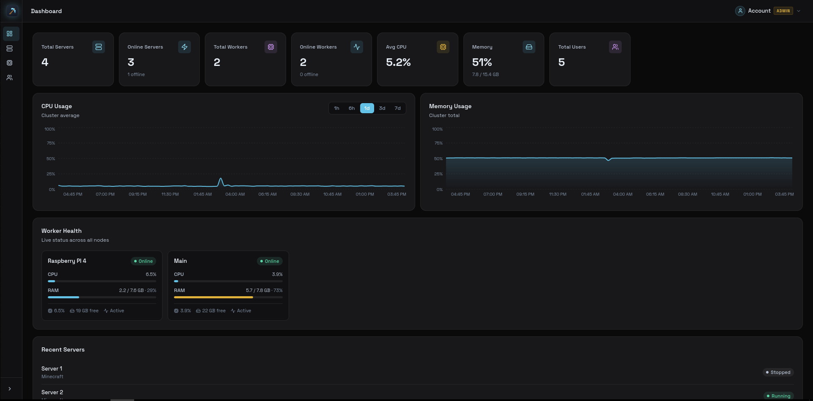
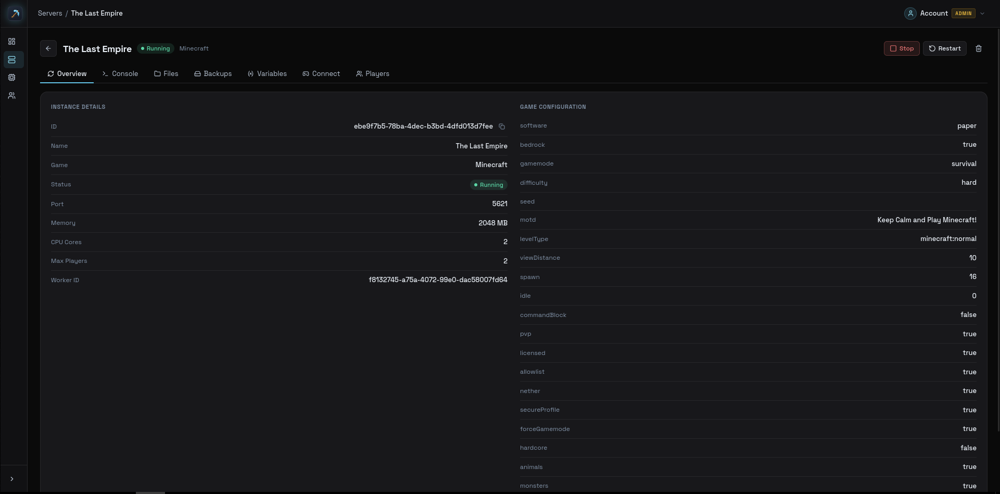
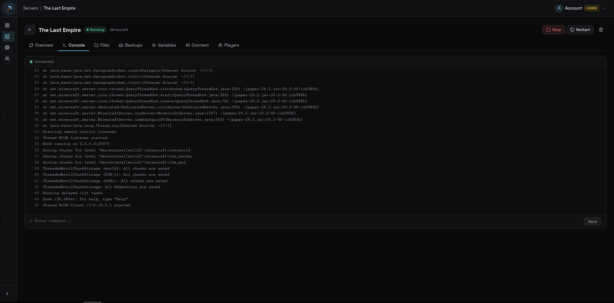
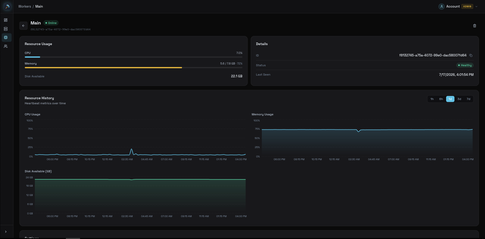

# NodeCraft

**A self-hosted panel for game servers across multiple machines.**

Create, configure and monitor game servers from one place. NodeCraft brings together a live console, file management, backups, user permissions and worker monitoring, with Minecraft, Terraria and Kerbal Space Program integrations. Hytale support is still in progress.



---

## 📖 Overview

**NodeCraft** is my personal project for hosting and managing multiplayer game servers. The panel covers the day-to-day workflow: creating a server, changing its settings, working with its files, following the console and keeping backups.

The system is split into three independent services that talk over authenticated HTTP + WebSockets:

| Service | Role | Port |
|---------|------|------|
| **`manager`** | Central control plane — authentication, database, quotas, scheduling; orchestrates the workers. | `9183` |
| **`worker`** | Runs game instances and manages their files, console and backups on a host machine. | `9184` |
| **`web`** | React single-page app — the user-facing control panel. | `3030` (dev) |

NodeCraft runs in a self-hosted environment behind Nginx and systemd, with deployment through GitHub Actions. The public panel is not linked here because new accounts have no instance allowance until an administrator grants one.

---

## ✨ Key Features

- 🖧 **Distributed worker fleet** — the manager coordinates any number of worker machines; each reports CPU / memory / disk health every 15s and is marked unhealthy if it goes silent.
- 🎮 **Multi-game support** — Minecraft (Java + Bedrock via Geyser/Floodgate), Terraria, Kerbal Space Program and Hytale, each with its own runtime and settings.
- 💻 **Real-time console** — live server output and command input streamed over Socket.io, secured with short-lived (120s) scoped JWTs so the browser talks straight to the worker.
- 📁 **Full file manager** — browse, edit, upload, download, move, delete and unzip files inside a server's game folder, proxied through the manager to the right worker.
- 🔐 **JWT auth + email flows** — access/refresh token rotation via httpOnly cookies, email verification and password reset (Nodemailer).
- 🧑‍⚖️ **Granular per-instance permissions** — share specific panel actions with other users; manage Minecraft player access and privileges through a separate roster.
- 📊 **Resource quotas** — per-user limits on instance count, total memory, CPU, disk and which games / workers they may use.
- 💾 **Automated S3 backups** — nightly scheduled backups to any S3-compatible bucket (Backblaze / MinIO / AWS), with daily + weekly retention and automatic pruning.
- 📈 **Monitoring dashboard** — historical worker hardware metrics rendered as charts (Recharts).
- 📄 **Fully documented API** — modular OpenAPI 3.0 spec served through Swagger UI at `/docs`.

| Server details | Live console |
| --- | --- |
|  |  |

---

## 🔐 Authentication & Permissions

- **Access token** — JWT (15 min), delivered in an httpOnly `accessToken` cookie.
- **Refresh token** — 3 days, stored **SHA-256 hashed** in the DB and rotated on every refresh.
- **Email flows** — account verification and password reset via time-limited tokens.
- **Per-instance permissions** — access is granted at the level of individual actions. Every route and socket event enforces its exact permission on the backend; the frontend mirrors the same rules to gate the UI.
- **Instance links** — owners can share specific panel permissions with other users. Minecraft player access and operator privileges are managed separately through the roster.

---

## 🔄 Communication & Trust

- **Worker → Manager** authenticates with a per-worker API key (`MANAGER_API_KEY`, stored SHA-256 hashed).
- **Manager → Worker** authenticates with the worker's `MANAGER_SECRET`.
- Long-running worker actions return promptly and continue asynchronously; the resulting status is reported back to the manager.
- The manager flags a worker `healthy: false` after 3 minutes without a heartbeat.

---

## 💾 Backups

- The manager's `BackupScheduler` checks during the 03:00 hour for recently active instances on healthy workers.
- The worker stops an instance if it is running, zips the game's important files, uploads the archive under its `daily/` or `weekly/` storage path, starts the instance again and reports the result.
- **Retention:** 7 daily + 4 weekly, pruned automatically after each upload.
- Backups require S3-compatible storage to be configured on the worker.

---

## 📊 Resources and Monitoring

Administrators configure each user's allowed games and workers, maximum instance count, CPU, memory and disk allowance. Server slots and reported disk usage count across all owned instances; CPU and memory usage count instances that are running or starting. A stopped server therefore keeps its files and slot while releasing its active CPU and memory allocation.

The worker applies CPU and memory settings when starting an instance and reports its disk usage to the manager. Disk allowance is currently checked when creating or starting instances; it is not a filesystem quota on uploads or archive extraction.

Worker charts show CPU usage, used and total memory, and available disk space. The manager retains seven days of heartbeat history, with views from one hour to seven days. Server status and recent history help distinguish a requested action from its eventual result on the worker.



---

## 🧰 Tech Stack

**Manager**
`Node.js (ES Modules)` · `Express 5` · `Sequelize` (SQLite dev / MySQL prod, migration-driven) · `JWT` · `bcrypt` · `Joi` · `Nodemailer` · `Socket.io-client` · `Pino` · `Swagger UI` + `@apidevtools/swagger-parser` · `Helmet`

**Worker**
`Node.js (ES Modules)` · `Express 5` · `dockerode` · `Socket.io` · `rcon-client` · `gamedig` · `@aws-sdk/client-s3` · `archiver` / `unzipper` · `systeminformation` · `Pino`

**Web**
`React 19` · `Vite 6` · `React Router 7` · `Recharts` · `Socket.io-client` · `lucide-react` · custom Minecraft-themed design system

**Infra & DX**
`Docker` · `Nginx` · `systemd` · `GitHub Actions` (SSH deploy) · `ESLint` (Airbnb base)

---

## 🎮 Supported Games

| Game | Backups | RCON | Notes |
|------|:-------:|:----:|-------|
| **Minecraft** | ✅ | ✅ | Java + Bedrock (Geyser + Floodgate), allowlist and player roster |
| **Terraria** | ✅ | ❌ | Server configuration and world backups |
| **Kerbal Space Program** | ✅ | ❌ | Multiplayer settings and backups |
| **Hytale** | Planned | ❌ | Integration is present but not yet ready for normal use |

Each game has a `Runtime` class extending a shared base `Instance`. Minecraft adds `server.properties` synchronization and player access control through its roster.

---

## 📄 API Documentation

The manager exposes a fully documented, modular **OpenAPI 3.0** spec:

```
http://localhost:9183/docs
```

Every endpoint carries a `summary` + `description`, request/response schemas, examples and error responses — split across `paths/` and reusable `components/` and bundled at startup with `@apidevtools/swagger-parser`.

---

## 🚀 Running locally

### 📋 Prerequisites
You will need Node.js and npm. The worker also needs a host prepared to run game servers and access to its configured storage paths. The commands below start the applications; host preparation is a separate step.

### 1. 🧠 Manager
```bash
cd manager
npm install
cp .env.example .env        # configure DB, email, site URLs
npm run db:migrate          # schema is managed exclusively by migrations
npm run dev                 # → http://localhost:9183  (Swagger at /docs)
```

Set `STAGE=DEV` and a `JWT_SECRET` in `manager/.env` for local development.

### 2. ⚙️ Worker
```bash
cd worker
npm install
cp .env.example .env        # configure MANAGER_URL, keys, storage, paths
npm run dev                 # → http://localhost:9184
```

### 3. 🌐 Web

Set `VITE_API_URL=http://localhost:9183` in `web/.env.local` so the panel connects to the manager.

```bash
cd web
npm install
npm run dev                 # → http://localhost:3030
```

> **Database note:** the schema is managed **exclusively** through Sequelize migrations (`npm run db:migrate`) — `db.sync()` is never used, so dev (SQLite) and prod (MySQL) stay in lockstep.

---

## ⚠️ Operational Limitations

- **Moving a server between workers:** Changing its worker does not move its files. Stop the server, make a separate backup and copy the data before starting it elsewhere. Files left on the old worker are eligible for deletion after five days.
- **Minecraft roster changes:** Player removals and privilege changes in the panel do not update a running game server. Restart it to apply them; until then, previous access or operator privileges may remain active.

Other outstanding issues are tracked in the [manager review](docs/review/manager.md) and [worker review](docs/review/worker.md).

---

## ⚙️ Deployment

Production is a single-command, push-to-deploy setup:

1. **GitHub Actions** (`.github/workflows/deploy.yml`) triggers on push to `main` and SSHes into the server.
2. **`deploy.sh`** pulls the code, installs deps (`npm ci --omit=dev`), runs `sequelize-cli db:migrate`, builds the web app, and copies it to the Nginx web root.
3. **systemd** units (`nodecraft-manager`, `nodecraft-worker`) are restarted; **Nginx** reverse-proxies the API and serves the SPA.

Config templates live in [`scripts/`](scripts/).

---

## 👨‍💻 Author

**João Pedro Tomaz dos Santos** — Backend / Full-stack Developer

[](https://github.com/jsantos43)

---

## 📜 License

Released under the **MIT License** — see [LICENSE](LICENSE).
